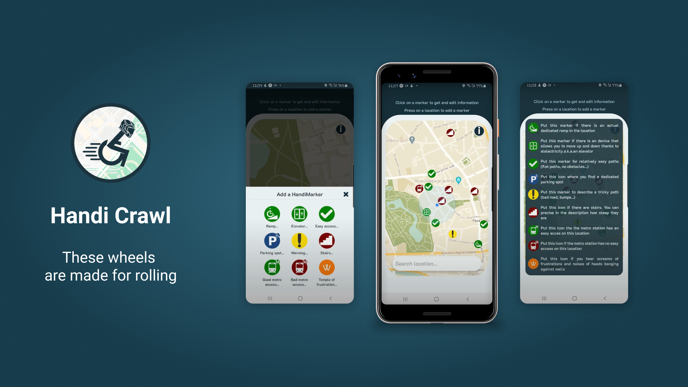

<p>


</p>

# Handi Crawl

A **React Native** app that helps people with physical impairments tracking architectural barriers.



Users can **add markers on the map** to notify others about accessibility issues of public places.
Data is saved in [Firebase](https://firebase.google.com/)'s **Firestore**.

## Goals

Given an [existing project](https://github.com/CalimeRon/HandiCrawl) (by Ron Chamma) here are the tasks we were assigned:

- [x] **Refactor** codebase enforcing consistent naming and separation of concerns
- [x] Implement unit and integration **tests** achieving high coverage

## Getting started

Run the app locally by executing the following commands

```bash
git clone https://github.com/vikvikvr/HandiCrawl
cd HandiCrawl/client
npm install
npm start
```

You can run it on an [Android](https://docs.expo.io/workflow/android-studio-emulator/) or [iOS](https://docs.expo.io/workflow/ios-simulator/) emulator
