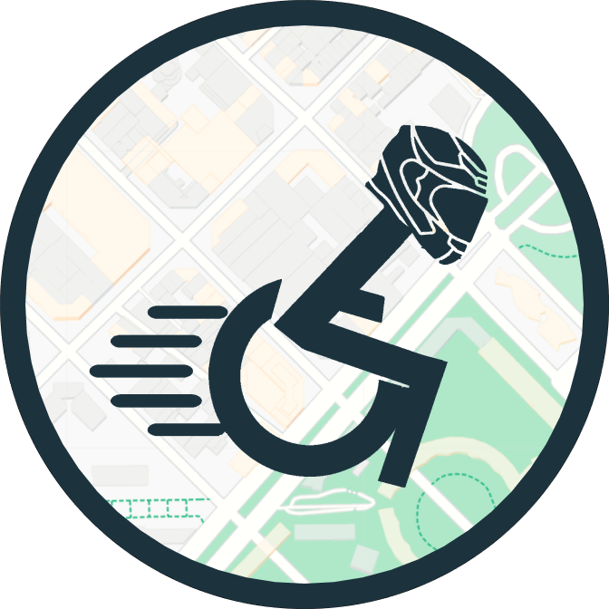

<p>


</p>
# HandiCrawl

These wheels are made for rolling.

A React Native app that helps people with physical impairments tracking architectural barriers.




[Original project](https://github.com/CalimeRon/HandiCrawl) by Ron Chamma

## Goals

Given an existing project these are the tasks we were assigned:

- [x] **Refactor** codebase enforcing consistent naming and separation of concerns
- [x] Implement unit and integration **tests** achieving high coverage

## Getting started

Run the app locally by executing the following commands

```bash
git clone https://github.com/vikvikvr/HandiCrawl
cd HandiCrawl/client
npm install
npm start
```

You can run it on an [Android](https://docs.expo.io/workflow/android-studio-emulator/) or [iOS](https://docs.expo.io/workflow/ios-simulator/) emulator
